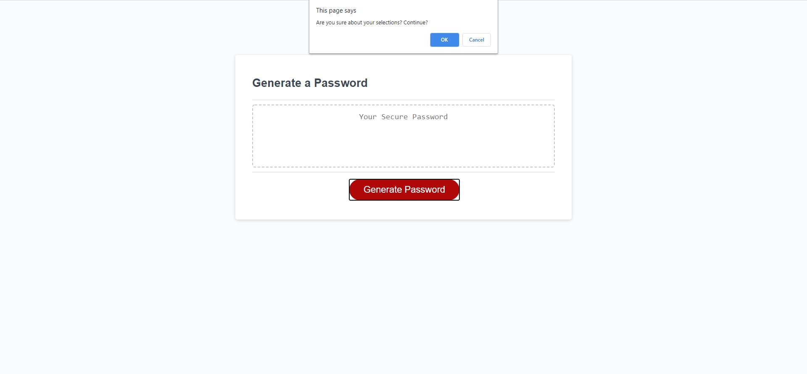

# Password Generator

## Description

The goal of this refactor was to provide a password length of 8-128(explicitly selected by user), with or without but requireing at least one of the following selections made by the user: Special Character, Lower/Upper case letters, and numbers.

### Minor HTML changes

The only lines of code that were changed in the given HTML were the file paths to both the CSS and JavaScript files. The CSS file remained untouched.

### JavaScript

In the begining of the project my mind, when thinking of ways to select numbers, characters, and special characters, went immediately to ACII conversions. However, realizing that with all the selectors that the user would choose, the implementation would be very messy later down the line (i.e. randomly choosing from however many selectors inedpendently the user chose, combining them into an array, then randomly choosing from the array.)

So thinking that there might be a better way of choosing from all of these different characters and doing some digging a stackoverflow forum that had them all in a string popped up. It was so simple that it was pretty frustrating that hadn't come to mind in the first place. The only issue with what was found was that the array of characters was just that, an array with all of the characters. So adapting it to the requirments of the project led to having 5 independent strings, one for numbers, upper letter, lower letter, specials, and an empty string to append each to on a case by case basis based on selections.

With my dynamic string selection process in place, I created a random number generator that adjusts to a given min and max value. Added all the prmpts for the user to select their preferences and error catching. This however, is where my program gets more complex...

I decided to learn asynchronous programming for JS, and by the end of this while I wouldn't say i'm good at it yet but I at least know enough to do simple asynchnous functions, and multipromise callback resolutions in the form of promise.all using await. The biggest challenge I faced while learning this technique/technology was catching up to where the youtube teachers JS proficiencies were as I have just started learning it. While this wasn't entirely necessary given the size of the program, it now runs 4x faster than others. I aim to use asynchronous programming whenever I can in future homeworks and add other techniques to accompany it in the future.

## Screenshots

## Deployed Project

https://brandonshoemaker.github.io/Password-Generator/

## Installation

1. Navigate with cd to your desired directory via your GIT bash. 
1,2. (If you don't have GIT bash) Follow this link to download GIT bash and follow their instructions: https://git-scm.com/download/win
2. Once in the desired directory, type the following command: git clone git@github.com:coding-boot-camp/friendly-parakeet.git
3. Profit

## Contributors

HTML/CSS: Xandromus, JS: Mostly Brandon Shoemaker